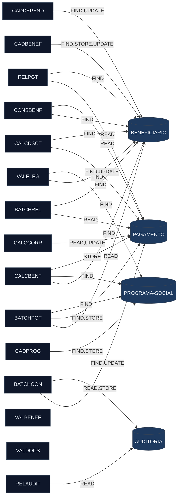
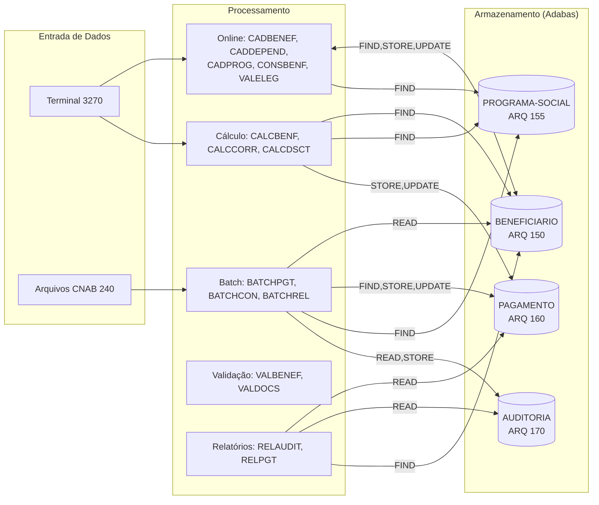

<!-- markdownlint-disable MD013 MD025 MD026 MD028 MD029 MD034 MD040 MD051 MD060 -->

# Mapa de Dependências — SIFAP Legado

  

> 🗺 **Você está aqui:** [Kit PT-BR](../README.md) → [Estágio 1](README.md) → **dependency-map**

> **Para quem é isto?** Este é um **artefato preenchido pelo time** durante o Estágio 1 (Arqueologia).
>
> **O que você terá ao final do estágio:**
>
> 1. Este documento totalmente preenchido com os dados reais do legado SIFAP
> 2. Rastreabilidade para `01-arqueologia/legado-sifap/` (programas `.NSN` e DDMs)
> 3. Base de evidência usada nas EARS do Estágio 2 (`source_legacy:`)
>
> 📘 **Guia passo a passo:** [`GUIDE.md`](GUIDE.md).

> Use diagramas Mermaid para mapear as dependências entre programas Natural e DDMs Adabas.
> O objetivo é visualizar "quem chama quem" e "quem lê/escreve o quê".

## Como as dependências foram descobertas

- `grep CALLNAT *.NSN` → **zero resultados** (nenhuma chamada inter-program)
- `grep INCLUDE *.NSN` → **zero resultados** (nenhum copycode compartilhado)
- `grep PERFORM *.NSN` → 23 ocorrências (todas internas — DEFINE SUBROUTINE no mesmo arquivo)
- `grep -E "FIND|READ|STORE|UPDATE" *.NSN` → 80 ocorrências (acesso a dados via DDM VIEWs)

## Achado Crítico — Zero CALLNAT / Zero INCLUDE

**Não existem instruções CALLNAT nem INCLUDE em nenhum dos 15 programas.**

Os programas são unidades autônomas que se comunicam exclusivamente por **acoplamento via dados** — leem e escrevem nos mesmos arquivos Adabas (DDMs). O cabeçalho do BATCHPGT afirma "CHAMA CALCBENF E CALCDSCT" (L14), mas o código real **duplica a lógica inline** em vez de fazer CALLNAT. <!-- MYSTERY: documentação do cabeçalho diverge do comportamento real -->

## Diagrama de Dependências (Completo — 15 Programas + 4 DDMs)

## Diagrama de Fluxo de Dados (DDMs)

## Tabela de Dependências (Completa)

| Programa | Chama (CALLNAT) | Lê (READ/FIND) DDMs | Escreve (STORE/UPDATE) DDMs | Observações |
|----------|-----------------|----------------------|-----------------------------|-------------|
| BATCHPGT.NSN | — | BENEFICIARIO (READ L182), PAGAMENTO (READ L171, FIND L202), PROGRAMA-SOCIAL (FIND L214) | PAGAMENTO (STORE L335) | Lógica calc duplicada de CALCBENF |
| BATCHCON.NSN | — | PAGAMENTO (FIND L139), AUDITORIA (READ L88) | PAGAMENTO (UPDATE L178,185,192), AUDITORIA (STORE L249,268) | Conciliação CNAB 240 |
| BATCHREL.NSN | — | PAGAMENTO (READ L105), BENEFICIARIO (FIND L112) | — | Relatório consolidado |
| CALCBENF.NSN | — | BENEFICIARIO (FIND L148), PROGRAMA-SOCIAL (FIND L167) | PAGAMENTO (STORE L286) | Motor de cálculo principal |
| CALCCORR.NSN | — | PAGAMENTO (READ L128) | PAGAMENTO (UPDATE L162) | Correção IPCA retroativa |
| CALCDSCT.NSN | — | PAGAMENTO (FIND L74), BENEFICIARIO (FIND L88,108) | PAGAMENTO (UPDATE L181) | Descontos por faixa + judicial |
| CADBENEF.NSN | — | BENEFICIARIO (FIND L139,201) | BENEFICIARIO (STORE L197, UPDATE L213) | Cadastro beneficiário |
| CADDEPEND.NSN | — | BENEFICIARIO (FIND L46,95,110) | BENEFICIARIO (UPDATE L120) | Dependentes via PE group |
| CADPROG.NSN | — | PROGRAMA-SOCIAL (FIND L77,109) | PROGRAMA-SOCIAL (STORE L102) | Cadastro prog social |
| CONSBENF.NSN | — | BENEFICIARIO (FIND L88,92), PAGAMENTO (READ L151) | — | Consulta online 3270 |
| RELAUDIT.NSN | — | AUDITORIA (READ L92) | — | Relatório auditoria |
| RELPGT.NSN | — | PAGAMENTO (READ L82), BENEFICIARIO (FIND L104) | — | Relatório pagamentos |
| VALBENEF.NSN | — | — | — | Validação em memória (VIEW não usada) |
| VALDOCS.NSN | — | — | — | Validação documentos em memória |
| VALELEG.NSN | — | BENEFICIARIO (FIND L70), PROGRAMA-SOCIAL (FIND L88) | — | Validação elegibilidade |

## Dependências Circulares

Nenhuma — não existem chamadas inter-program (zero CALLNAT).

## Programas Isolados (sem acesso a dados)

- **VALBENEF.NSN** — define VIEW de BENEFICIARIO mas não faz FIND/READ. Parece ser uma rotina de validação pura (pure function).
- **VALDOCS.NSN** — idem. Valida CPF, RG e documentos especiais sem acessar o banco.

> Nenhum programa é "órfão" no sentido clássico (sem chamador) porque **não há chamadas inter-program**. Todos os 15 programas são entry-points independentes.

## Sub-rotinas Internas (PERFORM)

| Programa | Sub-rotina | Linha | Propósito |
|----------|-----------|-------|-----------|
| BATCHPGT | DET-FAIXA-RENDA-BATCH | L262 | Determina fator renda por faixa |
| BATCHCON | GRAVA-AUDITORIA-CONC | L201 | Grava audit de conciliação |
| BATCHCON | GRAVA-AUDITORIA-DIVERG | L167 | Grava audit de divergência |
| BATCHREL | IMPRIME-CABECALHO | L172 | Cabeçalho relatório paginado |
| CALCBENF | DET-FAIXA-RENDA | L202 | Determina fator renda por faixa |
| CALCBENF | CALC-DESCONTOS | L263 | Desconto simplificado 3% |
| CALCCORR | CALC-INDICE-ACUM | L149 | Acumula IPCA mensal |
| CALCDSCT | CALC-CONTRIB-SOCIAL | L99 | Alíquota progressiva por faixa |
| CADBENEF | VALIDA-CPF | L112 | Validação mod-11 |
| CADPROG | CONSULTA-PROG | L57 | Exibe dados de programa |
| CONSBENF | MASCARA-CPF | L107 | Oculta dígitos sensíveis |
| RELAUDIT | IMPRIME-CAB-AUDIT | L165 | Cabeçalho paginado audit |
| RELPGT | IMPRIME-SUBTOTAL | L94,174 | Subtotal por programa |
| RELPGT | IMPRIME-CABECALHO | L145 | Cabeçalho paginado pgtos |
| VALBENEF | VALIDA-CPF-COMPLETO | L115 | CPF mod-11 + todos-iguais |
| VALBENEF | VALIDA-DATA | L125 | Valida data nascimento |
| VALBENEF | VALIDA-NOME | L135 | Nome+sobrenome obrigatório |
| VALDOCS | VALIDA-CPF-DOC | L68 | CPF mod-11 |
| VALDOCS | VALIDA-RG | L78 | RG mín 5 chars |
| VALDOCS | CHECK-DOC-ESPECIAL | L88 | Prefixos governo/teste |
| VALELEG | VERIF-ELEG-ESPECIFICA | L207 | Regras por tipo programa |

## Referências Quebradas

| Tipo | Origem | Referência | Observação |
|------|--------|-----------|-----------|
| Cabeçalho divergente | BATCHPGT.NSN:L14 | "CHAMA CALCBENF E CALCDSCT" | Código não faz CALLNAT — duplica lógica inline |
| Sub-rotina comentada | BATCHCON.NSN:L222 | PERFORM CONCILIA-REAL | Banco Real descontinuado (2007) |

## Estatísticas

| Métrica | Valor |
|---------|-------|
| Total de programas | 15 |
| Total de arestas programa→dados | 33 |
| Total de arestas programa→programa | **0** |
| DDM mais acessado | BENEFICIARIO (11 programas) |
| DDM com mais escritas | PAGAMENTO (STORE×2 + UPDATE×3) |
| Programa mais conectado | BATCHPGT (3 DDMs, 5 operações) |
| Programas sem acesso a dados | VALBENEF, VALDOCS |

## Implicações para Modernização

1. **Não há call graph** — modularização é livre no sistema novo
2. **Acoplamento por dados** → bounded contexts naturais: `beneficiario`, `pagamento`, `programa-social`, `auditoria`
3. **Lógica duplicada** (BATCHPGT ≈ CALCBENF) → centralizar em um único service
4. **VALBENEF + VALDOCS são pure functions** → validadores stateless ideais

---

### Continuar a leitura

<table width="100%">
<tr>
<td width="50%" valign="top" align="left">
<strong>← ANTERIOR</strong> 
<a href="business-rules-catalog.md"><strong>business-rules-catalog.md</strong></a> 
Catálogo de regras.
</td>
<td width="50%" valign="top" align="right">
<strong>PRÓXIMO →</strong> 
<a href="discovery-report.md"><strong>discovery-report.md</strong></a> 
Síntese final.
</td>
</tr>
</table>

↑ <a href="README.md">Voltar ao Kit PT-BR</a>

