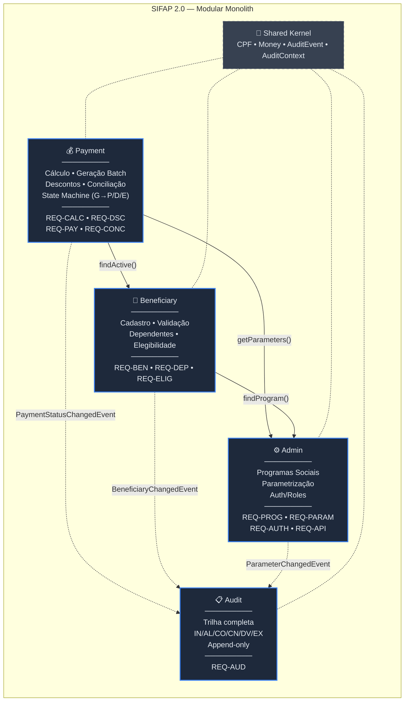
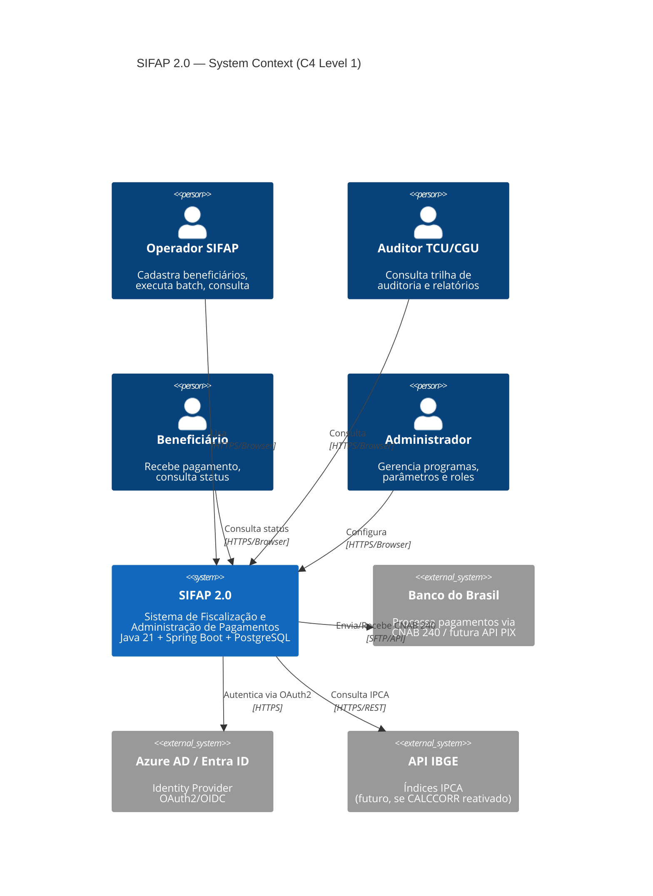
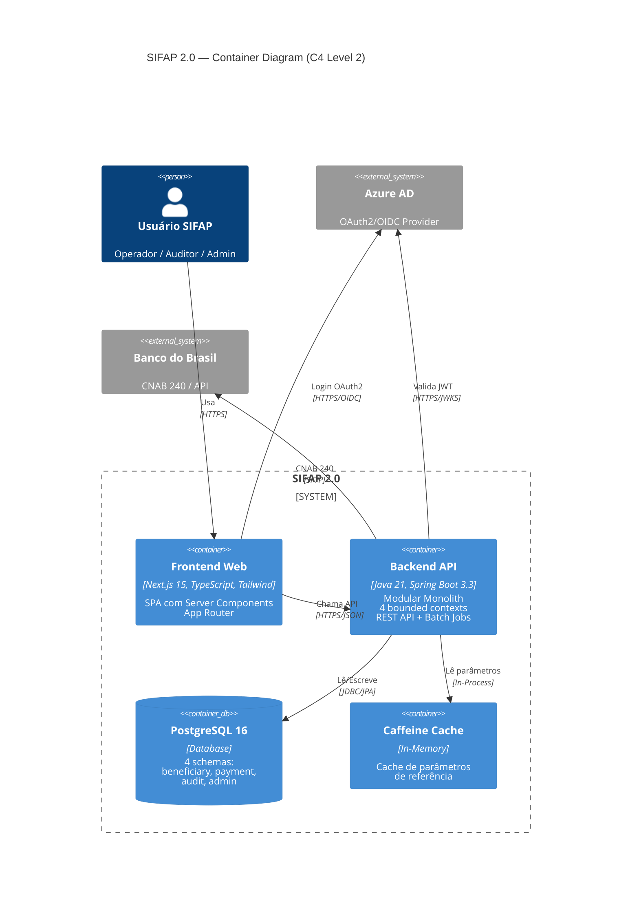
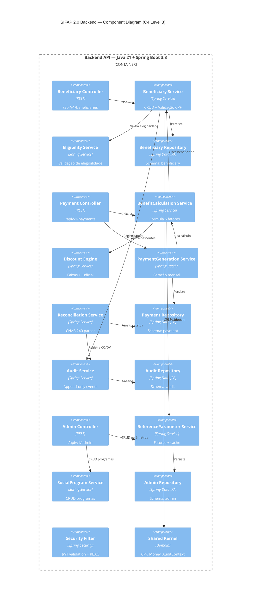

# Mapa de Bounded Contexts — SIFAP 2.0

## Metadados

- **Time:** DataCorp Verde 01
- **Data:** 20/05/2026
- **Base:** `01-arqueologia/dependency-map.md` + `02-spec-moderna/SPECIFICATION.md`
- **ADR:** ADR-001 (Monolito Modular)

---

## Avaliação de Hipóteses

### Hipótese 1: Contexto Único (Monolito sem fronteiras) — REJEITADA

| Critério | Avaliação | Evidência |
|----------|-----------|-----------|
| Coesão | BAIXA | Cálculo financeiro + cadastro + auditoria + relatórios no mesmo pacote |
| Acoplamento | ALTO | Qualquer mudança impacta todo o sistema |
| Frequência de mudança | DIVERGENTE | Cadastro muda raramente; descontos mudam por lei; auditoria é estável |

**Rejeitada:** reproduziria o anti-padrão do legado (15 programas acessando as mesmas 4 DDMs sem fronteiras).

---

### Hipótese 2: 6 Contextos (um por família de programa) — REJEITADA

| Critério | Avaliação | Evidência |
|----------|-----------|-----------|
| Coesão | ALTA por contexto | Cada família (CAD, CALC, BATCH, VAL, REL, CONS) é coesa |
| Acoplamento | ALTO cross-context | CALC e BATCH compartilham a mesma fórmula; VAL e CAD operam sobre o mesmo aggregate |
| Frequência de mudança | SIMILAR entre CALC/BATCH | Sempre mudam juntos — separar não faz sentido |

**Rejeitada:** granularidade excessiva; CALC+BATCH são um só domínio (Payment), VAL+CAD são um só domínio (Beneficiary).

---

### Hipótese 3: 4 Contextos alinhados a ownership de dados — ACEITA

| Critério | Avaliação | Evidência |
|----------|-----------|-----------|
| Coesão | ALTA | Cada contexto é dono exclusivo de suas entidades |
| Acoplamento | BAIXO | Comunicação via interfaces de domínio (não via shared tables) |
| Frequência de mudança | INDEPENDENTE | Beneficiary muda por cadastro; Payment por ciclo mensal; Audit quase nunca |

**Aceita:** alinha com os 4 DDMs do legado (BENEFICIARIO, PAGAMENTO, PROGRAMA-SOCIAL, AUDITORIA) e com o padrão Modular Monolith (ADR-001).

---

## Bounded Contexts Finais

### 1. Beneficiary (Cadastro + Validação + Dependentes)

- **Responsabilidade:** Ciclo de vida do beneficiário — cadastro, alteração, validação de CPF/documentos, gestão de dependentes, validação de elegibilidade.
- **Dados sob ownership:** `beneficiary`, `beneficiary_dependent`, `beneficiary_discount` (schema `beneficiary`)
- **Programas legados mapeados:** CADBENEF, CADDEPEND, VALBENEF, VALDOCS, VALELEG, CONSBENF
- **REQ-IDs:** REQ-BEN-001 a 006, REQ-DEP-001 a 005, REQ-ELIG-001 a 004
- **Interface pública:** `BeneficiaryService` (CRUD + validação), `EligibilityService` (check elegibilidade)
- **Por que é seu próprio contexto:** Entidade hub central (11 progs acessavam no legado). Ownership claro do aggregate Beneficiary. Mudanças em cadastro não devem afetar cálculo financeiro.

### 2. Payment (Cálculo + Geração + Descontos + Conciliação)

- **Responsabilidade:** Cálculo de benefícios, geração batch, aplicação de descontos, ciclo de vida (G→P/D/E), conciliação bancária.
- **Dados sob ownership:** `payment`, `payment_batch_run` (schema `payment`)
- **Programas legados mapeados:** CALCBENF, CALCDSCT, BATCHPGT, BATCHCON, CALCCORR
- **REQ-IDs:** REQ-CALC-001 a 010, REQ-DSC-001 a 005, REQ-PAY-001 a 005, REQ-CONC-001 a 004
- **Interface pública:** `BenefitCalculationService`, `PaymentGenerationService`, `DiscountEngine`, `ReconciliationService`
- **Por que é seu próprio contexto:** Core financeiro do sistema. Lógica de cálculo é a mais complexa (fórmula com 6 fatores). Ciclo mensal é processo batch autônomo. Descontos são subdomain do Payment (compartilham o mesmo aggregate Payment).

### 3. Audit (Trilha de Auditoria)

- **Responsabilidade:** Registrar toda ação do sistema (IN, AL, CO, CN, DV, EX), prover consulta e relatórios de auditoria.
- **Dados sob ownership:** `audit_event` (schema `audit`)
- **Programas legados mapeados:** RELAUDIT, (parte de BATCHCON que grava auditoria)
- **REQ-IDs:** REQ-AUD-001 a 003
- **Interface pública:** `AuditService.record(AuditEvent)`, `AuditQueryService`
- **Por que é seu próprio contexto:** Append-only por natureza (nunca altera, nunca deleta). Consumidor de eventos de todos os outros contextos. Requisitos de compliance (TCU/CGU) separados das regras de negócio. Potencial de volume muito alto (primeiro candidato a extração futura).

### 4. Admin (Programas Sociais + Parametrização + Usuários)

- **Responsabilidade:** CRUD de programas sociais, gestão de tabelas de referência (fatores, faixas, alíquotas), configuração do sistema.
- **Dados sob ownership:** `social_program`, `reference_parameter`, `reference_parameter_history` (schema `admin`)
- **Programas legados mapeados:** CADPROG, BATCHREL (parte relatórios)
- **REQ-IDs:** REQ-PROG-001 a 003, REQ-PARAM-001 a 002, REQ-AUTH-001 a 002, REQ-API-001 a 002
- **Interface pública:** `SocialProgramService`, `ReferenceParameterService`, `AuthContext`
- **Por que é seu próprio contexto:** Dados de referência consumidos por Payment e Beneficiary mas com ownership separado. Muda por decisão política/legislativa (frequência diferente de Payment que muda mensalmente). Gestão de acesso é transversal mas administrada aqui.

---

## Comunicação Entre Contextos

| De | Para | Mecanismo | Dados | Direção |
|----|------|-----------|-------|---------|
| Payment | Beneficiary | Interface síncrona | `BeneficiaryService.findActive()` — lê status e dados do beneficiário | Request |
| Payment | Admin | Interface síncrona | `ReferenceParameterService.getByCategory()` — lê fatores/faixas | Request |
| Payment | Audit | Domain Event assíncrono | `PaymentStatusChangedEvent` — notifica transição de status | Event |
| Beneficiary | Audit | Domain Event assíncrono | `BeneficiaryChangedEvent` — notifica inclusão/alteração | Event |
| Beneficiary | Admin | Interface síncrona | `SocialProgramService.findActive()` — valida programa na elegibilidade | Request |
| Admin | Audit | Domain Event assíncrono | `ParameterChangedEvent` — notifica alteração de referência | Event |

### Shared Kernel (tipos cross-cutting)

```
shared/
├── domain/
│   ├── CPF.java              (value object — validação módulo 11)
│   ├── Money.java            (value object — truncamento 2 decimais)
│   ├── AuditEvent.java       (record publicado por todos os contextos)
│   └── AuditContext.java     (JWT subject + session + IP)
└── infrastructure/
    └── security/
        └── SecurityConfig.java
```

---

## Diagrama de Bounded Contexts (Mermaid)



---

## Diagrama C4 — Level 1: System Context



---

## Diagrama C4 — Level 2: Container



---

## Diagrama C4 — Level 3: Components (Backend)



---

## Mapeamento Legado → Moderno

| Programa Legado | Bounded Context | Componente Moderno |
|-----------------|-----------------|-------------------|
| CADBENEF.NSN | Beneficiary | BeneficiaryService |
| CADDEPEND.NSN | Beneficiary | BeneficiaryService (dependents) |
| VALBENEF.NSN | Beneficiary | CPF (shared kernel) |
| VALDOCS.NSN | Beneficiary | CPF + DocumentValidator |
| VALELEG.NSN | Beneficiary | EligibilityService |
| CONSBENF.NSN | Beneficiary | BeneficiaryController (GET) |
| CALCBENF.NSN | Payment | BenefitCalculationService |
| CALCDSCT.NSN | Payment | DiscountEngine |
| BATCHPGT.NSN | Payment | PaymentGenerationService |
| BATCHCON.NSN | Payment | ReconciliationService |
| CALCCORR.NSN | — (descartado) | — |
| BATCHREL.NSN | Admin/Reporting | Futuro: ReportService |
| RELAUDIT.NSN | Audit | AuditQueryService |
| RELPGT.NSN | Payment | PaymentController (GET + export) |
| CADPROG.NSN | Admin | SocialProgramService |

---

## Definição de Pronto

- [x] Hipóteses avaliadas (3 hipóteses, 2 rejeitadas, 1 aceita)
- [x] 4 bounded contexts nomeados com ownership de dados
- [x] Comunicação entre contextos definida (síncrono + eventos)
- [x] Shared kernel identificado (CPF, Money, AuditEvent, AuditContext)
- [x] Diagrama Mermaid renderiza (bounded contexts + C4 L1 + L2 + L3)
- [x] Mapeamento legado → moderno completo (15 programas)