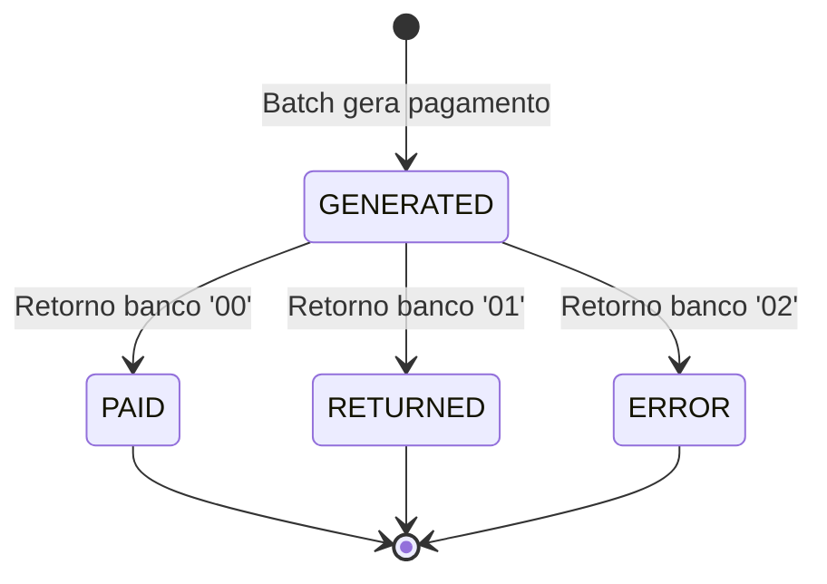

# ADR-005 — Máquina de Estados Formal para Pagamentos

## Status

✅ **Accepted** · 20/05/2026 · Par 2 (EA + SA) · Revisão: Par 4 (QA)

## REQs vinculados

REQ-PAY-002 (status inicial), REQ-PAY-003 (ciclo de vida), REQ-AUD-001 (auditoria de transição)

## ADRs vinculados

ADR-001 (Monolito Modular — módulo payment), ADR-002 (Persistência — coluna status)

## Contexto

O legado SIFAP tem um ciclo de vida de pagamento implícito: G (gerado) → P (pago) / D (devolvido) / E (erro). Porém:

- **Não há guard clause**: BATCHCON atualiza status sem verificar o estado atual (MYS-017). Um pagamento 'D' (devolvido) poderia ser alterado para 'P' se reprocessado.
- **Não há auditoria de transição**: apenas a ação final é logada, não a transição de→para.
- **Não há validação de transições permitidas**: qualquer combinação era aceita silenciosamente.

A modernização precisa de uma máquina de estados formal que:
1. Garanta que apenas transições válidas ocorram.
2. Rejeite transições inválidas com erro explícito.
3. Registre toda transição na auditoria.

## Opções Consideradas

### Opção A — Validação ad-hoc em cada service method

- **Prós:** Simples de implementar; sem dependência externa.
- **Contras:** Validação espalhada pelo código; fácil de esquecer em novo endpoint; sem visualização centralizada das transições.
- **Custo/Risco:** Custo baixo; risco médio (inconsistência ao longo do tempo).

### Opção B — State Machine formal com enum + transition map (escolhida)

- **Prós:** Transições definidas em um único lugar; compilador garante exhaustiveness; fácil de testar; diagrama gerado automaticamente; domain event emitido em cada transição.
- **Contras:** Mais código upfront; enum precisa de método para cada transição válida.
- **Custo/Risco:** Custo médio; risco baixo; excelente manutenibilidade.

### Opção C — Spring State Machine (biblioteca)

- **Prós:** Framework maduro; suporta guards, actions, listeners; persistência de estado.
- **Contras:** Over-engineering para 4 estados e 3 transições; curva de aprendizado; dependência pesada para caso simples; difícil de debugar.
- **Custo/Risco:** Custo alto; risco médio (complexidade desnecessária).

## Decisão

Adotar **Opção B** — State Machine implementada como sealed interface + enum no domínio.

### Design

```java
public enum PaymentStatus {
    GENERATED,  // 'G' — estado inicial
    PAID,       // 'P' — pagamento efetuado
    RETURNED,   // 'D' — devolvido pelo banco
    ERROR;      // 'E' — erro bancário

    private static final Map<PaymentStatus, Set<PaymentStatus>> TRANSITIONS = Map.of(
        GENERATED, Set.of(PAID, RETURNED, ERROR),
        PAID,      Set.of(),  // terminal — sem transição
        RETURNED,  Set.of(),  // terminal — sem transição
        ERROR,     Set.of()   // terminal — sem transição
    );

    public boolean canTransitionTo(PaymentStatus target) {
        return TRANSITIONS.getOrDefault(this, Set.of()).contains(target);
    }

    public PaymentStatus transitionTo(PaymentStatus target) {
        if (!canTransitionTo(target)) {
            throw new InvalidStateTransitionException(this, target);
        }
        return target;
    }
}
```

### Regras

1. **GENERATED** é o único estado inicial (REQ-PAY-002).
2. **PAID**, **RETURNED** e **ERROR** são estados terminais — sem transição de saída.
3. Toda tentativa de transição inválida lança `InvalidStateTransitionException` (HTTP 409).
4. Toda transição bem-sucedida emite `PaymentStatusChangedEvent` (consumido pelo módulo audit).
5. Guard clause obrigatório: verificar `canTransitionTo()` ANTES de persistir.

### Diagrama de Estados



### Integração com Auditoria

```java
// No PaymentService
public Payment reconcile(Long paymentId, BankReturnCode code) {
    Payment payment = repository.findById(paymentId).orElseThrow();
    PaymentStatus previousStatus = payment.getStatus();
    PaymentStatus newStatus = previousStatus.transitionTo(code.toPaymentStatus());
    payment.setStatus(newStatus);
    
    // Domain event → módulo audit consome
    domainEvents.publish(new PaymentStatusChangedEvent(
        payment.getId(), previousStatus, newStatus, AuditContext.current()
    ));
    
    return repository.save(payment);
}
```

## Consequências

### Positivas
- Guard clause resolve MYS-017 (legado não verificava status antes de update).
- Transições inválidas são impossíveis — compilador + runtime protegem.
- Diagrama de estados serve como documentação viva.
- Auditoria de transição automática via domain event.
- Testabilidade: enum é puro, sem dependência — unit test trivial.

### Negativas
- Se novos estados forem necessários (ex.: 'CANCELLED'), precisa alterar enum + map.
- Enum não é extensível em runtime (mas para este domínio, estados são estáveis há 29 anos).

### Riscos
- Se domain event falhar ao publicar, transição é feita mas auditoria perdida → mitigar com @TransactionalEventListener (same transaction).

## Critérios de Envelhecimento

Revisitar se:
- 🚨 Necessidade de mais de 8 estados (considerar Spring State Machine)
- 🚨 Transições condicionais complexas (guards com regras de negócio)
- 🚨 Necessidade de fork/join no ciclo de vida (pagamento parcial)

## Referências

- `01-arqueologia/business-rules-catalog.md` — BR-082 (ciclo de vida)
- `01-arqueologia/mysteries-found.md` — MYS-017 (sem guard clause)
- `02-spec-moderna/SPECIFICATION.md` — REQ-PAY-003
- Vaughn Vernon, *Domain-Driven Design Distilled* (2016) — Aggregates and state transitions